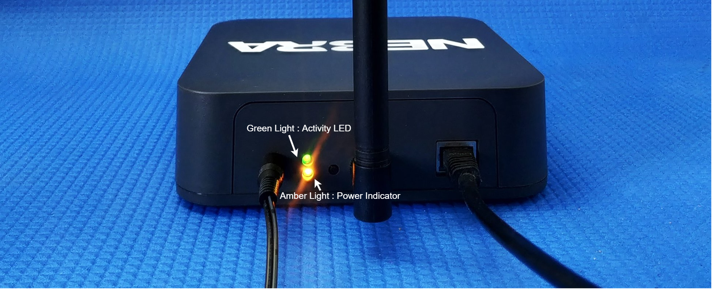
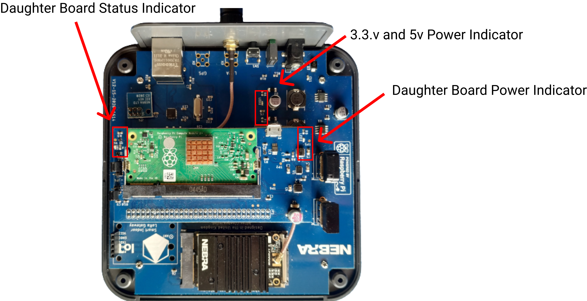

# Nebra Helium Hotspot Advanced Diagnostics Information

* [Nebra Indoor Hotspot](#nebra-indoor-hotspot)
    * [External lights](#external-lights)
    * [Internal Lights](#internal-lights)
* [Nebra Outdoor Hotspot](#nebra-outdoor-hotspot)
* [Nebra CM3 Daughterboard Lights](#nebra-cm3-daughterboard-lights)
* [Daughterboard Jumpers](#daughterboard-jumpers)

## Nebra Indoor Hotspot

The Nebra Indoor Hotspot has six lights that can indicate certain issues or conditions.

### External lights
The main lights are located on the back of the unit, one green, and one amber.

**Amber Light: Power Indicator**  - This should turn on as soon as the unit is plugged in, it will indicate that power is present.

**Green Light: Activity LED**  - This light will turn on one minute after powering up, indicating the software has started. It should then advance to become a slow blink.

#### Green Light Blinking  Status 

* Blink fast if diagnostics are not OK
* Blink slowly if advertising Bluetooth
* Solid if diagnostics are OK and not advertising 

If the light does not turn on, there may be an issue with the daughterboard inside the unit. Open your unit and investigate, many issues can be resolved by reseating components.

### Internal Lights

The Indoor hotspot has 4 internal lights. 

* **Daughter Board Status Indicator** :  In normal operation, this BLUE led will turn off. During boot, it will blink several times.

* **3.3v and 5v Power Indicator** : These are two RED LEDs that indicate the 3.3v and 5v power supply status. 

*  **Duagther Board Status Indicator**: This green LED indicates power is present for the daughterboard.

## Nebra Outdoor Hotspot

Many similarities exist between the indoor and outdoor units. The internal lights are the same, with an addition of a flashing RED light that will be present on the USB hub.

If you are using a cellular plan for your outdoor unit, it's possible that this connection will not work when WIFI and ETH are in use for data. Your unit will always choose connections in the following order: Ethernet -> Wifi -> Cellular. Be sure to eliminate any connection that will interfere with cellular use.

## Nebra CM3 Daughterboard Lights

The CM3 daughterboard has two lights, one near the USB port, and one near the two jumpers.

The one near the USB port is under EMF tape, this should be a solid green once power is applied.

The second, near the jumpers, is a blue LED and should occasionally blink. If it blinks four times, this indicates the unit does not have an active connection to Ethernet.

If this light does not blink at all, it could indicate that the compute module is experiencing issues.

## Daughterboard Jumpers

**JP3 - Power Jumper**
JP3 enables the unit to enter program mode.

**JP4 - Onboard Flash Jumper**
This jumper is used in conjunction with JP3 to put the CM3 into program mode. This disables the onboard flash and the CM3 is ready to receive data over MicroUSB.

**Only to be connected if you are connecting to a computer to view the files and/or make changes. No external power is required, you will need compute module drivers found [here].(https://github.com/raspberrypi/usbboot/raw/master/win32/rpiboot_setup.exe)**

**For normal operation the JP4 jumper should be in position 1+2**
