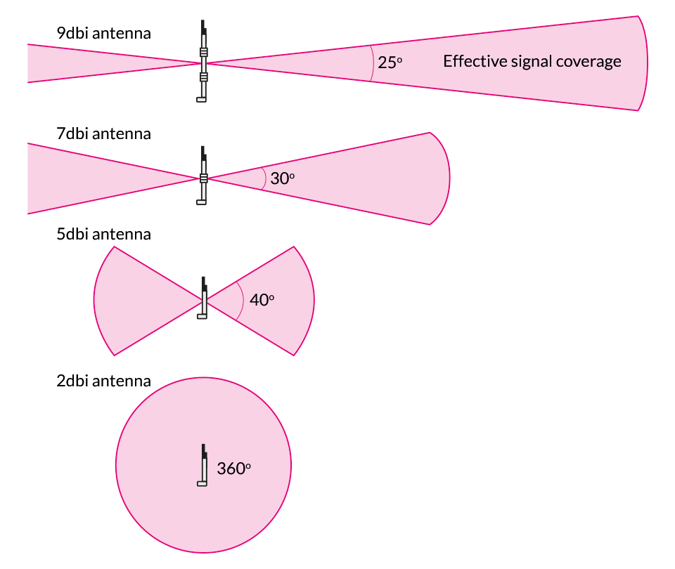
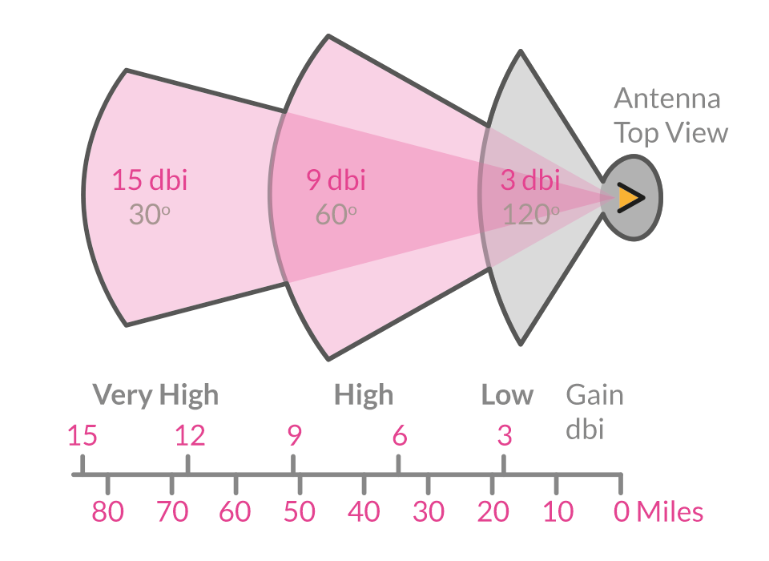

# Antenna 📡

An Antenna is a transducer that converts radio frequency (RF) fields into alternating current or vice versa. 

### Contents 

* [Antenna Definitions](#definitions)
* [Antenna Connectors](../../handy-guides/antenna/connectors.md)
* [Antenna Connections](../../handy-guides/antenna/connections.md)

## Definitions

* **Antenna gain** : is the relative measurement of an antenna’s ability to direct or concentrate the radiated signal emitting from it. Gain is measured in Dbi (decibels relative to an isotropic radiator) or Dbd (decibels relative to a dipole radiator).

* **Isotropic radiator** : is a theoretical single point in space that radiates energy equally in every direction similar to the Sun radiating its light. The isotropic radiator exhibits the same magnitude or properties when measured in all directions. It has no preferred direction of radiation. It radiates uniformly in all directions over a sphere centered on the source.

* **Decibels**: a unit used to measure the intensity of a sound or the power level of an electrical signal by comparing it with a given level on a logarithmic scale. A change in power by a factor of 10 is a 10 dB change in level. for every 3db increase on the scale, its power is doubled.

| Antenna Length vs dBi | Antenna Reception |
|---| ---|
| |  | 

A bigger antenna doesn't necessarily mean wider/further coverage or more HNT earnings. Take a look at the images above and notice the different coverage for antennas. **The higher dBi antenna is, more narrow and longer its signal coverage gets**.

* Higher dBI: awesome performance on flat terrain
* Lower dBI: awresome performance on hill terrain
* Middle dBI: great all rounder

You can be looking at two different antennas that have the same gain according to the spec sheets, but one of them can have the potential to perform better than the other. An understanding of where and how the antenna will be deployed is key to help determine which environmental parameters are important and in turn which antenna would suit you best.

## 

#### Resource 
* [RF Line-of-Sight Tool](https://www.scadacore.com/tools/rf-path/rf-line-of-sight/) : This free online tool takes antenna height and the topographical formations of the earth to calculate the line-of-sight of a radio path. Note that buildings and other obstructions is not taken into consideration when calculating line-of-sight using this tool.

