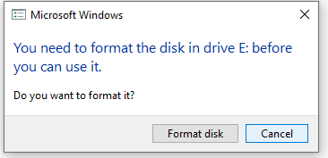
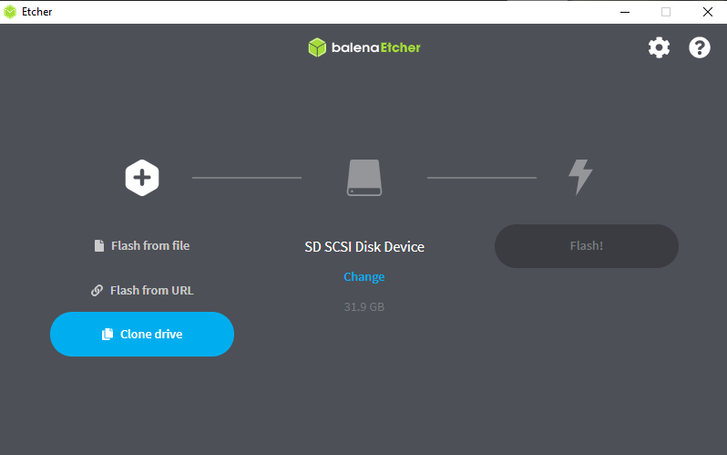
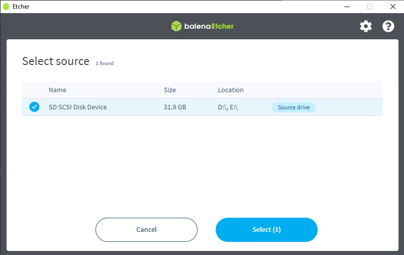
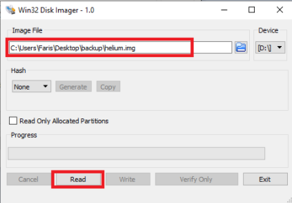
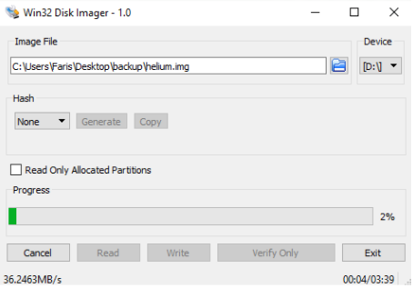
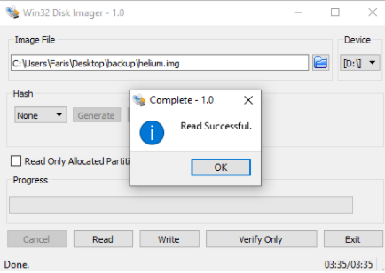
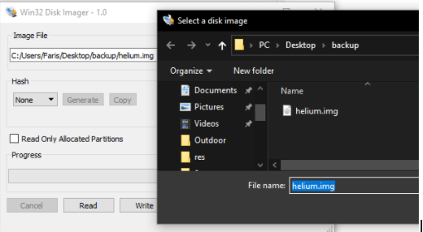
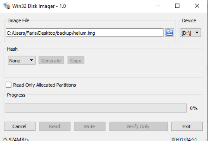

### Contents

* [Overview](#hotspot-backup-guide) 
* [External eMMC Module Clone](#external-emmc-module-clone)
* [External eMMC Module Backup](#external-emmc-module-backup)

# Hotspot Backup Guide 

In this guide, we will be looking into "How to backup hotspot software". 

Each device firmware is tightly coupled with their account so it's important to keep the backup in case something wrong happens.

## External eMMC Module Clone

Few device are shipped with external eMMC module. 

#### Required Tools

* Nebra external eMMC module 
* 32 GB Class 10 SD card 
* SD card  USB Reader 
* Desktop/Laptop Computer 

#### Step 1: Disconnect power and open Hotspot then Remove the external eMMC module. 

##### Step 1.1: Disconnect hotspot power 

##### Step 1.2: Open Hotspot -  Remove four screws/ use a plunger tool pop-up the lid if you  don’t have a screw )

##### Step 2.4: Remove the external eMMC module. 

#### Step 2: Download and install [Balena Etcher](https://www.balena.io/etcher/). 

#### Step 2: Connect external eMMC to computer. 

If you getting any warnning like this, please ignore. **DO NOT FORMAT!**

#### Step 3: Open "Balena Etcher" select "Clone drive" option. 

#### Step 4: To clone select your source as eMMC drive. 

#### Step 5: Connect new 32 GB memmory card and select as backup "target"

## External eMMC Module Backup 

#### Required Tools

* Nebra external eMMC module 
* 32 GB Class 10 SD card 
* SD card  USB Reader 
* Windows Computer

#### Step 1: Disconnect power and open Hotspot then Remove the external eMMC module. 

##### Step 1.1: Disconnect hotspot power 

##### Step 1.2: Open Hotspot -  Remove four screws/ use a plunger tool pop-up the lid if you  don’t have a screw )

##### Step 2.4: Remove the external eMMC module. 

#### Step 2: Download and Install [Win32 Disk Manager](https://sourceforge.net/projects/win32diskimager/)

#### Step 3: Connect external eMMC to computer via SD card reader. 

#### Step 4: Open [Win32 Disk Manager](https://sourceforge.net/projects/win32diskimager/) and Nname the backup file with extension '.img' and specify the backup location then click 'Read'. 

#### Step 5: Wait Until Backup is complete.

#### Step 6: Once it is complete, Click OK. 

#### Step 7:  Remove nebra external eMMC module and Insert SD Card.

> Now you successfully backup nebra hotspot firmware. If you want flash to an SD card you can continue to follow the instructions. 

#### Step 8:  Format the new SD card completely You can use [SD Card Formater](https://www.sdcard.org/downloads/formatter/) for this, then  Connect SD Card to your computer. 

( caution: this process will wipe everything in your SD card)

#### Step 9: Open Win32 Disk Manager and Select Previously Backuped  .Img File.

#### Step 10: After selecting the .img file click to write and wait until the writing is complete.  

#### Step 10: Done, Once complete Please remove the SD card and Insert it on your nebra hotspot.

