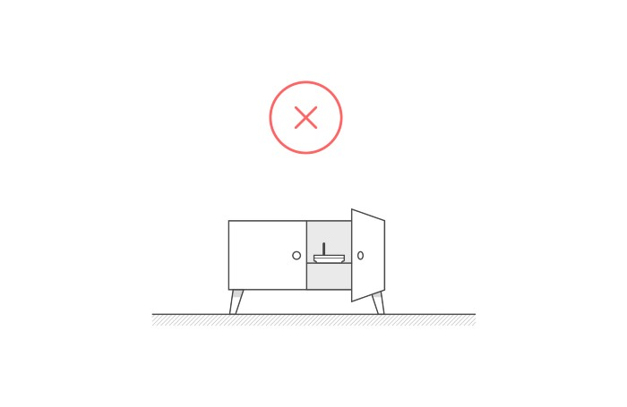

# Ideal Hotspot Placement 

On the Helium Network, participants earn HNT by mining and building coverage for The People’s Network using compatible Hotspots.

Hotspot Miners earn HNT in 3 ways:

* **Proof-of-Coverage** : Hotspots on the network are randomly and automatically assigned Proof-of-Coverage tests to complete. Passing and witnessing tests earns HNT. You can read more about the mechanics of PoC on [the Helium website](https://docs.helium.com/blockchain/proof-of-coverage).

* **Relay Device Data** : Hotspots earn HNT for transferring device data over the network. The more device data a Hotspot transfers, the more it earns. There are more details on [the Helium website](https://docs.helium.com/blockchain/helium-token).

* **Consensus Groups** : Trusted Hotspots are randomly elected to Consensus Groups, earning HNT by validating transactions and adding blocks to the blockchain. [more details](https://docs.helium.com/blockchain/consensus-protocol).

So it's all about your hotspot visibility and participation in the network, there are some techinque to improve these things, that's we are looking. If you found any mistake or need to add any point, please [open a issue](https://github.com/NebraLtd/Helium-Guides/issues/new), we are happy to look into that.

Please note that the earning will not just simply increase by following these steps, there are some external factors such as the number of **hotspots near by you** and the **hotspot density**, so please consider these factors too.  

We are going to take a look at some different parameters that improve the coverage and participation in the network. 
 
 
## Hotspot Location/Antenna View

Location of the hotspot or antenna view is very important, and it's play a key role. 

* Outside. Walls and even windows will block radio waves.
* High above other obstacles.
* Clear view to as much as possible.

Hotspots like to be deployed high up, overlooking wide-open spaces. If you have a house or apartment building with multiple floors, aim for the highest floor with a window. Ideally, your Hotspot has a clear view of the sky. (src: [blog.helium.com](https://blog.helium.com/helium-hotspot-101-1aa9dcecb5e))

 

Avoid putting the Hotspot in locations where it can’t see the outside world: in basements, in cabinets, behind TVs, metal screens, or ‘cyberglass’ in skyscrapers and things like that. (src: [blog.helium.com](https://blog.helium.com/helium-hotspot-101-1aa9dcecb5e))

 

Hotspots should not be deployed too close to one another. A good rule of thumb is to provide a minimum distance of 300 to 500 meters between Hotspots though this could vary depending on the environment (in a dense city closer, and in a more rural environment farther).(src: [blog.helium.com](https://blog.helium.com/helium-hotspot-101-1aa9dcecb5e))

A good rule of thumb to start approaching 90% of optimum earnings is at least 20' above your roof and surrounding roofs.(src: [nikhawks.medium.com](https://nikhawks.medium.com/a-rough-guide-to-helium-hotspot-placement-bb96b0b81343)

Here’s an example of a good elevation placement in a suburban location:

 
src: [nikhawks.medium.com](https://nikhawks.medium.com/a-rough-guide-to-helium-hotspot-placement-bb96b0b81343)

## Appropriate Antenna 

A bigger antenna doesn't necessarily mean wider/further coverage or more HNT earnings. Take a look at the images above and notice the different coverage for antennas. **The higher dBi antenna is, more narrow and longer its signal coverage gets**.

| Antenna Length vs dBi | Antenna Reception |
|---| ---|
| |  | 

* Higher dBI: awesome performance on flat terrain
* Lower dBI: awresome performance on hill terrain
* Middle dBI: great all rounder

You can be looking at two different antennas that have the same gain according to the spec sheets, but one of them can have the potential to perform better than the other. An understanding of where and how the antenna will be deployed is key to help determine which environmental parameters are important and in turn which antenna would suit you best.

You can read more about antenna [here](../handy-guides/antenna/overview.md) 

## Antenna cables 

Antenna cable also imporve your antenna performance, and not all cables are same, the price and signal drops are vary. 

As all cables will give some signal loss it\'s important to be able to calculate the losses and therefore know how this will affect the signal strength. 

Here is list cables and it's cable loss. 

| TYPE OF CABLE  |  LOSS / M  | DIAMETER |
|----------|:-------------:|------:|
| LMR-600 | ~0,08 dBm | 15 mm |
| LMR-400 | ~0,10 dBm | 10 mm |
| HDF-400 | ~0.13 dBm | 10 mm |
| LMR-300 | ~0.15 dBm | 08 mm |
| RG-401  | ~0.18 dBm | 6.4 mm |
| LMR-240 | ~0.24 dBm | 6 mm|
| RG-142  | ~0,25 dBm | 5 mm|
| RG-402  | ~0,25 dBm | 3.6 mm|
| RG-213/214 | ~0.26 dBm | 10 mm |
| RG-8X   | ~0.42 dBm | 6.4 mm|
| RG-405  | ~0.45 dBm | 2.1 mm|
| RG-58   | ~0.50 dBm | 5 mm |
| HDF-200 | 0.59 dBm  |	5 mm |
| RG-178  | ~1.00 dBm | 2 mm | 
| RG-174  | ~1.00 dBm | 2.5 mm| 

more details at [Antenna Connectors](handy-guides/antenna/connectors.md) 

If you found any mistake or need to add any point, please [open a issue](https://github.com/NebraLtd/Helium-Guides/issues/new), we are happy to look into that.

#### Resources

* [Antenna Height and Communications Effectiveness by ](https://www.arrl.org/files/file/antplnr.pdf)

* [A Rough Guide to Helium Hotspot Placement by Nik Hawks](https://nikhawks.medium.com/a-rough-guide-to-helium-hotspot-placement-bb96b0b81343)

* [Helium Hotspot 101 by  Mark Phillips](https://blog.helium.com/helium-hotspot-101-1aa9dcecb5e)

* [Helium ($HNT) Perfect Miner Placement - How Much I Earned In 1 Month](https://youtu.be/4gwvPywnhtI)
