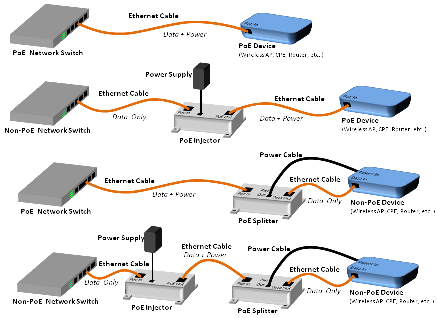

# Power over Ethernet Explained

## What is PoE?

[Power over Ethernet (PoE)](https://en.wikipedia.org/wiki/Power_over_Ethernet), is a method of being able to combine power into an Ethernet Cable to allow one cable to be used to provide both the power and data for a device.

The biggest benefit of PoE is that just the one cable needs to then be routed to the location of the hotspot.

## Injectors and Splitters

There are two parts to PoE...the side where the power is injected into the cable and the other end where the power and data are split apart.

### Injectors

Typically on the side where the network connection is provided, there is a PoE injector ("midspan") or the router or network switch itself is PoE enabled ("endspan").

These adaptors typically have a connector where one cable would connect to your Network's Router or Switch and a power input on one side. Then on the other side another Ethernet connector which you would connect to the end device.

In some cases you may find you already have a PoE enabled switch, these often can be identified by checking if your switch has ports marked PoE.

With these the injector is already built in and provides PoE power on the ports marked PoE.

### Splitters

On the device side, you then require a splitter or a PoE capable device.

A splitter separates the power from the Ethernet connection and typically provides the correct connections required for use (such as a DC jack output).

PoE uses 48 Volts, and a lot of devices will use 5, 9 or 12 volts so some splitters also adjust the voltage down to one suitable for use by the device. This is explained below in the [different standards](#different-standards) segment.

PoE capable devices such as the Nebra Outdoor Hotspot have a splitter built into them.

In cases like this no additional splitter is required and the network cable connects directly to the unit to provide power and network conncections.

Non PoE capable devices such as the Nebra Indoor Hotspot require a splitter in order to be powered via PoE.

## Different Standards

One common confusion with PoE is that there are different standards.

The most common standard, and often what is referred to as PoE is the 802.3af 48V standard. This is the main standard of PoE and is what the Outdoor Hotspot supports out of the box. It is sometimes also called "active" PoE because it requires an active "handshake" or "negotiation" between the powered device ("PD") and the injector/switch ("midspan" or "endspan"). With a suitable PoE injector (explained in the next part) this is the easiest setup with the outdoor hotspot.

The second most common standard is 12V "passive" POE which is where power is passed over the spare cable pairs on the Ethernet cable, however there is no active power negotiation between the injector and the end device. On long runs of cable, due to voltage drop accross the cable, the voltage can drop far below the input 12 Volts so if you use passive PoE injectors you need to use a multimeter to make sure that your device is receiving a suitable voltage at the output side.

## Connections

## What do I need?

#### For Indoor unit

If you wish to use PoE with the Indoor Hotspot you will require **active PoE injector** and an **active PoE splitter** that outputs **12V** to the unit. Alternatively you can use **passive PoE adapters** as long as the power provided to the unit is between **9 and 16 Volts** and can provide **15W** of power.

#### For Outdoor unit

For the outdoor unit you can directly connect it to a suitable 802.3af PoE injector or PoE enabled switch/router since it supports 802.3af PoE natively. You do not need spliters and if you do not already have a PoE enabled switch/router you can use a **802.3af 48V POE PoE injector**. 
